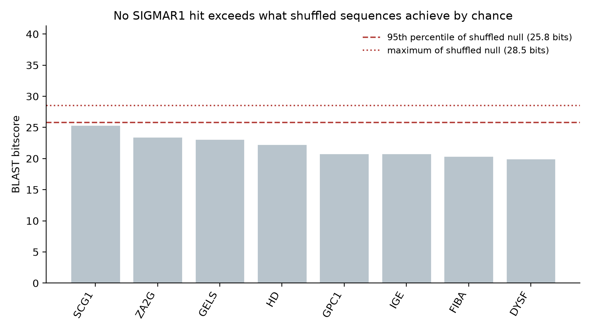
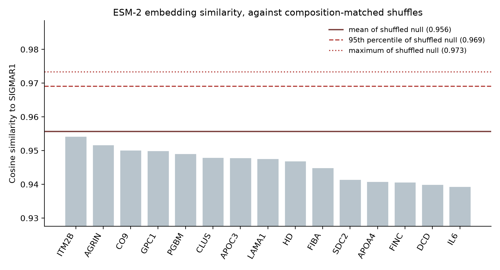
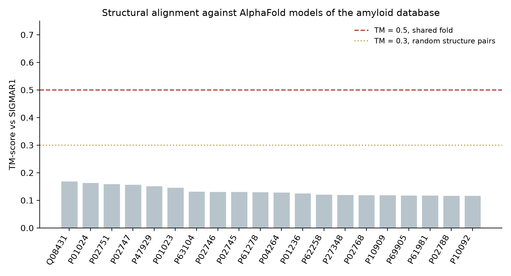
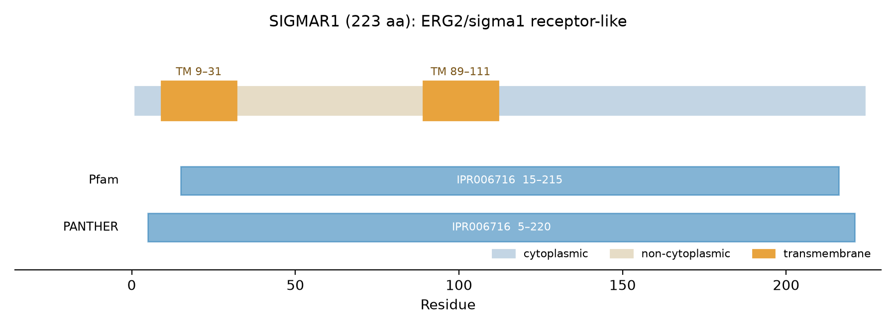
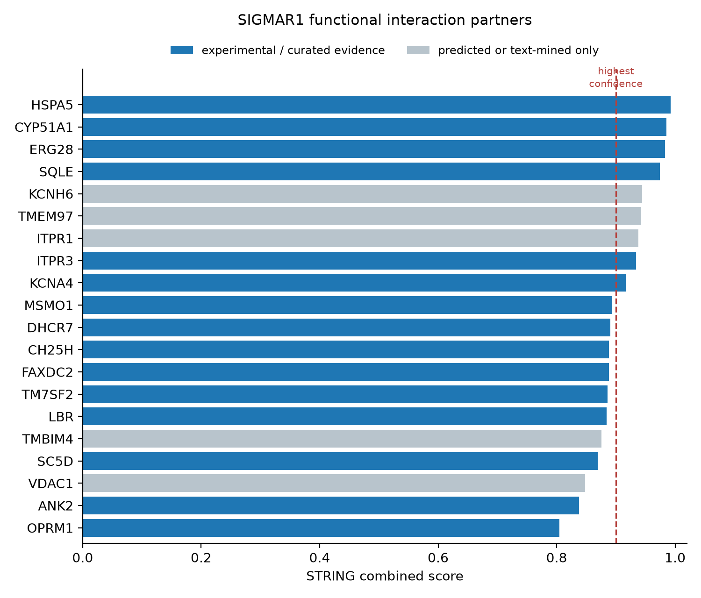

# Is SIGMAR1 Linked to the Amyloidoses? A Three-Tier Homology Assessment

[](https://github.com/aposfys/als-amyloid-network-analysis/actions/workflows/ci.yml)
[](https://github.com/aposfys/als-amyloid-network-analysis/actions/workflows/pipeline.yml)
[](https://www.python.org/)
[](LICENSE)
[](https://docs.astral.sh/ruff/)

**SIGMAR1** encodes the sigma-1 receptor, an ER chaperone whose loss-of-function mutations cause **ALS16**. This project asks whether that ALS link runs through the amyloidoses, by testing SIGMAR1 against a **custom BLAST database of 84 amyloid- and amyloidosis-associated proteins** built from [AmyCo](https://bioinformatics.biol.uoa.gr/amyco/), then following up with alignment, domain and network analysis.

The answer is a clean negative at the sequence level and a strong positive at the network level — and separating those two is the point of the project.

| Tier | Method | Result |
| --- | --- | --- |
| 1. Sequence | BLAST+ `blastp` + shuffled-sequence null | **No homology.** 0/84 significant; best hit scores below the random null |
| 2. Embedding | ESM-2 650M cosine similarity + shuffled null | **No homology.** Best cosine 0.954, but shuffled sequences average 0.956 |
| 3. Structure | Foldseek vs AlphaFold DB models | **No shared fold.** Max TM-score 0.170; 0 of 81 above 0.5 |
| Domain | InterPro (PANTHER, Pfam, Phobius, TMHMM) | Single family **IPR006716** over 97% of the protein; two TM helices; ER-localised |
| Network | STRING | **25 partners, 20 with experimental or curated evidence**; 273 terms enriched at FDR ≤ 0.05 |

## The headline result

<p align="center">
  
</p>

BLAST reports eight hits against the 84-protein database, with E-values from 0.15 to 8.4. **None is significant**, and it would be a mistake to rank them and interpret the top few — with a database this small, E-values are small numbers by construction.

To make that concrete, this project adds a **shuffled-sequence null model**: 100 replicates of the SIGMAR1 sequence with its residues randomly permuted, preserving length and amino-acid composition while destroying sequence order, each searched against the same database.

| | Bitscore |
| --- | ---: |
| Best real hit (SCG1_HUMAN) | 25.4 |
| Shuffled null, mean | 22.0 |
| Shuffled null, 95th percentile | 25.8 |
| Shuffled null, maximum | 28.5 |

The best genuine hit does not even reach the 95th percentile of what a *randomised* SIGMAR1 achieves. Empirical *p* > 0.05: **indistinguishable from chance**. The Clustal Omega alignment agrees — at 92% gaps and 7.6% mean pairwise identity across 85 sequences, the "coverage" figures that a naive reading might treat as similarity are an artefact of sequence length, not evidence of relatedness.

**SIGMAR1 is not a homologue of any amyloidogenic protein.** That is a real finding, not a failed experiment.

## Two more sensitive tests, both also negative

A negative BLAST result only rules out *detectable sequence* similarity. Two methods can see further, and both were run.

### Tier 2 — protein language model embeddings

<p align="center">
  
</p>

ESM-2 650M maps each protein to a 1280-dimensional vector shaped by patterns learned across UniRef, and proteins with shared structure or function can sit close together even when their sequences have diverged past alignment.

SIGMAR1's closest neighbour in that space is **ITM2B** (integral membrane protein 2B, itself an amyloidosis gene) at **cosine 0.954** — a number that looks like near-identity.

It is not. Shuffled SIGMAR1 sequences, with the same length and amino-acid composition but no sequence order at all, achieve a *higher* mean best cosine:

| | Best cosine to the database |
| --- | ---: |
| Real SIGMAR1 | 0.954 |
| Shuffled null, mean | **0.956** |
| Shuffled null, 95th percentile | 0.969 |
| Shuffled null, maximum | 0.973 |

**Mean-pooled embeddings encode amino-acid composition strongly, so almost any two proteins have a high cosine.** Without the null, 0.954 would have been reported as a striking similarity. This is the same control as the BLAST tier, and it is why it was applied here too.

### Tier 3 — structural alignment

<p align="center">
  
</p>

Structure outlives sequence. AlphaFold DB models were downloaded for SIGMAR1 and 81 of the 84 database proteins, and aligned with Foldseek in a purely local search.

**Maximum TM-score: 0.170. Zero structures reach the 0.5 threshold for a shared fold** — every alignment sits below 0.3, the level random structure pairs produce.

> **A trap worth naming.** Foldseek reports three TM-score columns. `alntmscore` is normalised by *alignment* length, so a short local match scores near 1.0 regardless of how little of either protein was involved — it can even exceed 1.0. Reading that column turns these 35-residue partial matches into 13 apparent fold-level hits, including an impossible TM-score of 1.045 against tau. The conventional TM-score, the one the 0.5 threshold was calibrated on, is normalised by chain length: `qtmscore`. Both are reported in the output CSV.

### All three tiers agree

Sequence, embedding and structure independently return nothing. A negative from any one method is weak evidence; a negative from all three, each with its own null or calibrated threshold, is strong.

## Where the actual evidence is

<p align="center">
  
</p>

InterPro assigns SIGMAR1 to a single family — **ERG2/sigma1 receptor-like (IPR006716)** — spanning 97% of its 223 residues, with two transmembrane helices (9–31, 89–111) and a large C-terminal cytoplasmic domain (112–223). There is no amyloidogenic domain, no low-complexity or prion-like region. The GO annotation is **endoplasmic reticulum (GO:0005783)**, which matters: ER stress and the unfolded protein response are established contributors to ALS pathogenesis.

<p align="center">
  
</p>

The STRING network is where the disease link becomes visible. All 25 partners clear STRING's *high confidence* threshold (9 reach *highest confidence*, ≥ 0.900), and 20 are backed by experimental or curated evidence rather than text mining alone. They fall into three functional modules:

- **ER chaperone / unfolded protein response** — `HSPA5` (BiP) at 0.992, the highest-scoring edge in the network and the best-characterised sigma-1 receptor partner.
- **ER calcium release** — `ITPR1`, `ITPR3`. Calcium dysregulation in motor neurons is a core ALS mechanism.
- **Sterol biosynthesis** — `CYP51A1`, `SQLE`, `ERG28`, `MSMO1`, `TMEM97`. This module dominates the enrichment: *steroid biosynthetic process* at FDR 3.3 × 10⁻¹⁸, *sterol biosynthetic process* at FDR 3.3 × 10⁻¹⁸.

Enriched cellular components are consistent throughout: *endoplasmic reticulum membrane* (18 genes, FDR 1.6 × 10⁻¹³). Among KEGG pathways, *Parkinson disease* is enriched (5 genes, FDR 1.2 × 10⁻³) — a neurodegeneration signal arriving through the network rather than through sequence.

**Notably, none of SIGMAR1's 25 STRING partners is itself in the 84-protein amyloid database.** The connection to neurodegeneration is real, but it runs through ER proteostasis, calcium handling and lipid metabolism — not through direct association with amyloidogenic proteins.

## Conclusion

Any link between SIGMAR1 and the amyloidoses is **functional and mechanistic, not evolutionary**. Sequence, embedding and structural search all correctly return nothing; the signal lives entirely in localisation, domain function and interaction context.

Methodologically the lesson generalises beyond this protein: **every similarity score needs a null before it means anything.** A BLAST E-value of 0.15 against an 84-sequence database, an embedding cosine of 0.954, and a Foldseek `alntmscore` of 1.045 all look like findings. None of them is one. The shuffled-sequence control and the correctly-normalised TM-score are what separate the three negatives from three false positives.

## Quick start

```bash
conda env create -f environment.yml   # BLAST+, Clustal Omega, Python deps
conda activate amynet
pip install -e ".[dev]"

make data       # fetch SIGMAR1 + the 84 AmyCo proteins from UniProt
make analysis   # run all four stages, write results/
make test
```

Individual stages, for iterating:

```bash
python -m amynet.cli --stages blast --null-replicates 1000
python -m amynet.cli --stages embedding --esm-model 35M   # faster, smaller model
python -m amynet.cli --stages structure                   # Foldseek vs AlphaFold DB
python -m amynet.cli --stages string
```

Results from earlier stages are preserved when you re-run a subset.

**Optional dependencies.** The base install needs Biopython and NumPy. The embedding tier additionally needs torch and transformers (`pip install -e ".[embeddings]"`); they are imported lazily, so the other five stages run without them. The structural tier needs `foldseek` on PATH (`conda install -c bioconda foldseek`) and downloads ~81 AlphaFold models on first run, cached afterwards.

## Reference database

The database (`amycodb`) is the 84 human proteins curated in **AmyCo** as causative of, or associated with, amyloidoses and amyloid deposition — including transthyretin (TTR), β2-microglobulin, serum amyloid A, α-synuclein, tau, prion protein, SOD1 and APP. Accessions are pinned in [`src/amynet/uniprot.py`](src/amynet/uniprot.py) so the database rebuilds identically, and sequences are fetched from the UniProt REST API rather than committed as binaries.

SIGMAR1 (Q99720) is deliberately **not** a member of its own search database — a test asserts this, since including it would make the search circular.

## Design decisions

Five choices that determine whether this analysis produces a conclusion or an artefact:

- **A negative result needs a null model.** BLAST against an 84-sequence database returns E-values between 0.15 and 8.4 — small-looking numbers that invite a ranking and a story about the top few. They are noise, and asserting that is not the same as showing it. The shuffled-sequence control makes the claim testable, and it is what turns "no significant hits" into a quantified statement.
- **Alignment coverage is not similarity.** In an 85-sequence alignment that is 92% gaps, a pair such as huntingtin and SIGMAR1 shows 98.7% "coverage" at 1.7% identity — an artefact of a 3,144-residue protein spanning a 223-residue one, not evidence of structural relatedness. Gap fraction, mean pairwise identity and conserved-column counts are reported instead, and they show the alignment carries no signal at all.
- **STRING edges are split by evidence class.** Text-mining-only associations are the weakest thing STRING reports and are easy to mistake for experimental support. Edges backed by experiments or curated databases are separated out, and FDR-controlled functional enrichment replaces visual inspection of the network image.
- **Predictor output formats disagree with each other.** Phobius reports `TRANSMEMBRANE` in the signature-accession column while TMHMM uses `TMhelix`; matching on the description field alone silently misses one of SIGMAR1's two TM helices. Both conventions are handled and overlapping predictions merged, with a test covering it.
- **Embedding similarity needs the same null as BLAST.** Mean-pooled language model vectors encode amino-acid composition heavily, so cosine similarities between arbitrary proteins routinely exceed 0.95. The shuffled-sequence control is what makes the number interpretable, and here it shows the observed 0.954 to be *below* the composition-matched average.
- **TM-scores must be normalised by chain length.** Foldseek's `alntmscore` divides by alignment length and inflates short local matches past 1.0. `qtmscore` is the value the 0.5 fold-similarity threshold was calibrated against.
- **The structural search runs locally.** AlphaFold models are downloaded once and searched with a local Foldseek database rather than a shared web service, so the result is reproducible and does not depend on someone else's queue.
- **Everything regenerates from source.** Sequences are fetched from UniProt by pinned accession, the BLAST database is rebuilt from scratch, AlphaFold URLs are resolved through the API rather than hardcoded to a model version, and 20 tests cover parsing, statistics and the biological invariants.

## Repository layout

```
src/amynet/
  uniprot.py    UniProt REST retrieval; the pinned AmyCo accession list
  blast.py      Database construction, blastp, and the shuffled null model
  msa.py        Clustal Omega, alignment statistics, hydropathy scan
  interpro.py   InterProScan TSV parsing, domain and topology summary
  embeddings.py ESM-2 embedding, cosine similarity, shuffled null
  structure.py  AlphaFold model retrieval and local Foldseek search
  stringdb.py   STRING network, evidence classes, functional enrichment
  plots.py      Figures
  cli.py        Staged pipeline
tests/          pytest suite (20 tests)
data/           Cached sequences and the InterPro annotation
results/        Generated tables and figures
```

## Output files

| File | Contents |
| --- | --- |
| `results/blast_hits.csv` | All hits with identity, E-value, bitscore, significance flag |
| `results/embedding_similarity.csv` | Cosine similarity of every database protein to SIGMAR1 |
| `results/foldseek_hits.csv` | Structural alignments with both TM-score normalisations |
| `results/alignment.aln` | 85-sequence Clustal Omega alignment |
| `results/alignment_coverage.csv` | Per-sequence coverage and identity against SIGMAR1 |
| `results/interpro_signatures.csv` | Every InterProScan signature with coordinates |
| `results/string_partners.csv` | Partners with per-channel evidence scores |
| `results/string_enrichment.csv` | Enriched terms at FDR ≤ 0.05 |
| `results/findings.json` | Machine-readable summary of all four stages |

## References

1. Nastou, K. C., Nasi, G. I., Tsiolaki, P. L., Litou, Z. I. & Iconomidou, V. A. (2019). AmyCo: the amyloidoses collection. *Amyloid* **26**, 112–117.
2. Al-Saif, A., Al-Mohanna, F. & Bohlega, S. (2011). A mutation in sigma-1 receptor causes juvenile amyotrophic lateral sclerosis. *Annals of Neurology* **70**, 913–919.
3. Hayashi, T. & Su, T.-P. (2007). Sigma-1 receptor chaperones at the ER-mitochondrion interface regulate Ca²⁺ signaling and cell survival. *Cell* **131**, 596–610.
4. Camacho, C. *et al.* (2009). BLAST+: architecture and applications. *BMC Bioinformatics* **10**, 421.
5. Sievers, F. *et al.* (2011). Fast, scalable generation of high-quality protein multiple sequence alignments using Clustal Omega. *Molecular Systems Biology* **7**, 539.
6. Paysan-Lafosse, T. *et al.* (2023). InterPro in 2022. *Nucleic Acids Research* **51**, D418–D427.
7. Szklarczyk, D. *et al.* (2023). The STRING database in 2023. *Nucleic Acids Research* **51**, D638–D646.
8. Lin, Z. *et al.* (2023). Evolutionary-scale prediction of atomic-level protein structure with a language model. *Science* **379**, 1123–1130. (ESM-2)
9. van Kempen, M. *et al.* (2024). Fast and accurate protein structure search with Foldseek. *Nature Biotechnology* **42**, 243–246.
10. Varadi, M. *et al.* (2024). AlphaFold Protein Structure Database in 2024. *Nucleic Acids Research* **52**, D368–D375.
11. Zhang, Y. & Skolnick, J. (2004). Scoring function for automated assessment of protein structure template quality. *Proteins* **57**, 702–710. (TM-score)
12. Kyte, J. & Doolittle, R. F. (1982). A simple method for displaying the hydropathic character of a protein. *Journal of Molecular Biology* **157**, 105–132.

## Data sources and licences

The MIT licence above covers **the code in this repository only**. The data it retrieves, and the third-party tools it invokes, carry their own terms.

| Source | Used for | Licence |
| --- | --- | --- |
| [UniProt](https://www.uniprot.org/help/license) | SIGMAR1 and the 84 reference sequences | CC BY 4.0 |
| [AmyCo](https://bioinformatics.biol.uoa.gr/amyco/) | The choice of which 84 proteins form the database | Accession list only — a set of identifiers, not redistributed AmyCo content |
| [AlphaFold DB](https://alphafold.ebi.ac.uk/) | Predicted structures for the Foldseek search | CC BY 4.0 (© DeepMind Technologies Ltd) |
| [STRING](https://string-db.org/cgi/access) | Interaction network and functional enrichment | CC BY 4.0 |
| [InterPro](https://www.ebi.ac.uk/about/terms-of-use/) | Domain and topology annotation | EMBL-EBI terms; CC0 where applicable |
| [BLAST+](https://blast.ncbi.nlm.nih.gov/) | Sequence similarity search | Public domain (NCBI) |
| [Clustal Omega](http://www.clustal.org/omega/) | Multiple sequence alignment | GPL-2.0-or-later |
| [Foldseek](https://github.com/steineggerlab/foldseek) | Structural alignment | GPL-3.0 |
| [ESM-2](https://github.com/facebookresearch/esm) | Sequence embeddings (code and weights) | MIT |

External tools are invoked as separate executables via `subprocess`, not linked into this codebase, so their copyleft terms do not extend to the code here. Anyone redistributing a bundle that *includes* those binaries takes on their obligations.

**What this repository ships.** For reproducibility, `data/` contains unmodified extracts from UniProt (`sigmar1.fasta`, `amycodb.fasta`), InterPro (`interpro_sigmar1.tsv`) and STRING (`string_*.tsv`). These are redistributed under the CC BY 4.0 terms of their sources, and the table above is the attribution. AlphaFold models are downloaded at run time and not committed. If you reuse results from this repository, cite the underlying resources as well.

---

Apostolos Fysekidis · [MIT Licence](LICENSE)
