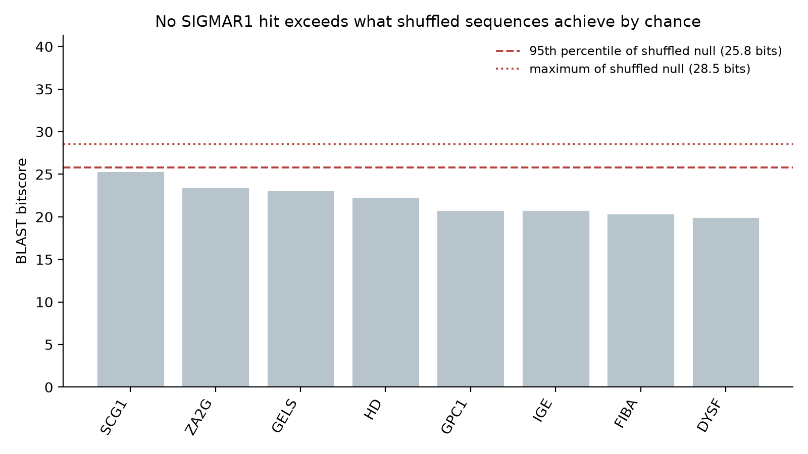

# Is SIGMAR1 Linked to the Amyloidoses? A Three-Tier Homology Assessment
Sequence, embedding, structure, propensity, domain and network analysis of SIGMAR1 (ALS16) against 84 amyloid-associated proteins.

[](https://github.com/aposfys/als-amyloid-network-analysis/actions/workflows/pipeline.yml)
[](LICENSE)

SIGMAR1 encodes the sigma-1 receptor, an ER chaperone whose loss-of-function mutations cause ALS16. This project asks whether that ALS link runs through the amyloidoses, by testing SIGMAR1 against the 84 amyloid- and amyloidosis-associated proteins curated in [AmyCo](https://bioinformatics.biol.uoa.gr/amyco/). Every similarity score is judged against its own null.

| Tier | Method | Result |
| --- | --- | --- |
| 1. Sequence | BLAST+ `blastp` + shuffled-sequence null | **No homology.** 0/84 significant. Best bitscore 25.4 is above the null mean (22.0) and below its 95th percentile (25.8) |
| 2. Embedding | ESM-2 650M cosine similarity + shuffled null | **No homology.** Best cosine 0.954, and shuffled sequences average 0.956 |
| 3. Structure | Foldseek vs AlphaFold DB models | **No shared fold.** Max TM-score 0.170, 0 of 81 above 0.5 |
| 4. Propensity | Hexapeptide scan vs the same 84 proteins | **Inconclusive.** Peak at the 47.6th percentile of the reference set, and the shuffle test detects only 11/84 known amyloid proteins, so it cannot support a negative |
| Domain | InterPro (PANTHER, Pfam, Phobius, TMHMM) | Single family **IPR006716** over 97% of the protein, two TM helices, ER-localised |
| Network | STRING | 25 partners, 20 with a nonzero experimental or curated-database score, 273 terms enriched at FDR ≤ 0.05. Descriptive, with no null |

<p align="center">
  
</p>

### What it shows

The three homology tiers are negative, each against its own null. The propensity screen does not separate SIGMAR1 from the amyloid set, and its shuffle test misses most known amyloid proteins, so it is reported as inconclusive rather than as a fourth negative. Four of SIGMAR1's five top windows sit in its first transmembrane helix, and the scale ranks the prion protein and IAPP near the top of the reference set but α-synuclein and tau near the bottom.

The STRING network places SIGMAR1 in ER chaperone, ER calcium-release and sterol-biosynthesis modules, and none of its 25 partners is in the amyloid set. That is context, not a test of the amyloid hypothesis. The published link between SIGMAR1 and amyloidogenesis runs through ER-mitochondria contact sites and was found by cell biology, not by sequence analysis. [docs/METHOD.md](docs/METHOD.md) has the detail and the prior work.

### Quick start

```
conda env create -f environment.yml   # BLAST+, Clustal Omega, Foldseek, Python deps
conda activate amynet
pip install -e ".[dev,embeddings]"

make data       # fetch SIGMAR1 + the 84 AmyCo proteins from UniProt
make analysis   # run all seven stages, write results/
make test
```

Stages run individually with `python -m amynet.cli --stages {blast,embedding,structure,propensity,msa,interpro,string}`, and results from earlier stages are preserved. Without the `embeddings` extra a default run skips the embedding stage and says so.

### More

- [The four tiers in full, prior work and design decisions](docs/METHOD.md)
- [Reference database, layout and output files](docs/RUNNING.md)
- [Data sources and licences](docs/DATA.md)

---

Apostolos Fysekidis · [MIT Licence](LICENSE)
